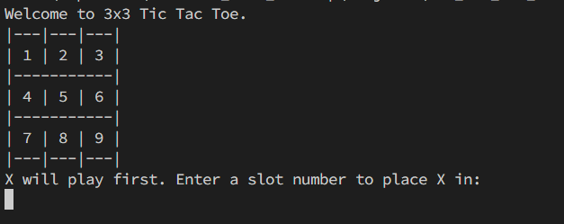
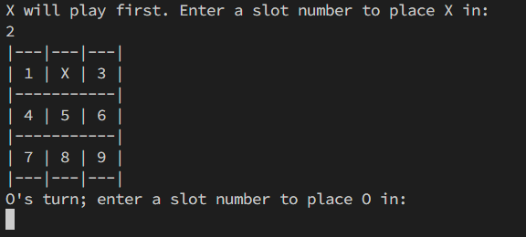
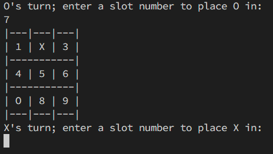

# 🎮 Tic-Tac-Toe Game

A simple command-line **Tic-Tac-Toe** game for two players. Players take turns to mark X or O on a 3x3 grid, aiming to align three of their symbols in a row, column, or diagonal.

## 🧩 Game Board Layout

## 🕹️ How to Play the Game

1. Two players choose their symbol: **X** or **O**.
2. A 3x3 grid is used with cells numbered from 1 to 9.
3. Player who chooses **X** goes first.
4. On their turn, players enter the cell number where they want to place their symbol.
5. Players alternate turns until one wins or the game ends in a draw.
6. A player wins if they fill an entire **row**, **column**, or **diagonal** with their symbol.

## 📥 Sample Input & Output

**Input:**  
`Enter a slot number to place X in: 3`

**Output:**

**Input:**  
`Now, O's turn, Enter a slot number to place O in: 5`

**Output:**

And the game continues...

## 👨‍💻 Tech Used

- Programming Language: ** Java **
- Environment: **Command Line / Terminal**

## 🏁 Game End Conditions

- ✅ **Win**: A player gets 3 of their symbols in a row, column, or diagonal.
- 🤝 **Draw**: All 9 slots are filled and no player has won.

## 📌 Note

This game is for **2 players** only. It does not include AI or automated opponent.

## 🧠 Future Improvements

- Add AI player (Minimax algorithm)
- GUI version using Python Tkinter / Java Swing
- Scoreboard tracking wins and draws

Happy playing! 🎉
